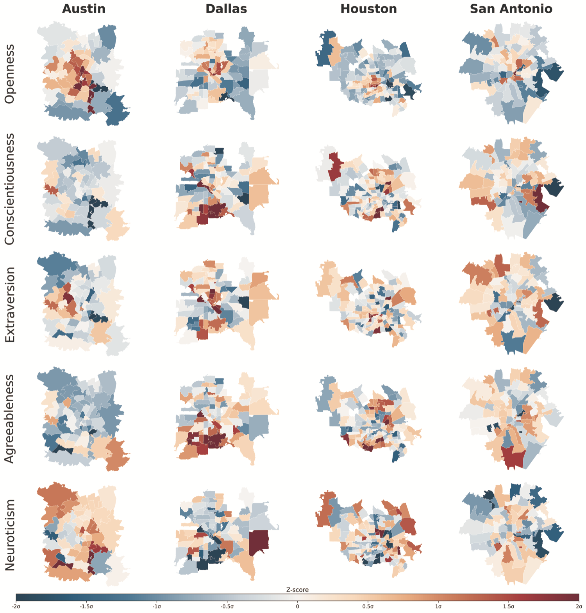

# Big Five Personality Traits and Built Environment Characteristics from Street View Imagery

Replication code and data for:

> Ito, K., Kang, Y., Gosling, S. D., Yao, X., Potter, J., & Biljecki, F. (2026).
> Uncovering the Associations between Human Big Five Personality Traits and Built
> Environment Characteristics from Street View Imagery.
> *Annals of the American Association of Geographers*.
> https://doi.org/10.1080/24694452.2026.2704575

The study relates ZIP-code-level Big Five personality trait scores to built
environment characteristics extracted from Google Street View imagery across four
Texas cities — Austin, Dallas, Houston, and San Antonio — using pooled and
city-specific OLS and spatial lag (SAR) models.


*Figure 1 — The data processing and analytical pipeline. Full resolution:
[`results/figures/KangFigure1.tif`](results/figures/KangFigure1.tif).*

This repository contains the minimum needed to reproduce the published models:
the analysis dataset, the modelling code, and the published outputs to check
against. The upstream imagery pipeline is included for reference but cannot be
re-run here (see [Scope and limitations](#scope-and-limitations)).

---

## Quick start

```bash
git clone https://github.com/koito19960406/personality-built-environment-svi.git
cd personality-built-environment-svi

python -m venv .venv && source .venv/bin/activate
pip install -r requirements.txt

python src/reproduce_models.py     # fits all 50 models, ~1 minute
python src/check_reproduction.py   # diffs the results against the published outputs
```

`check_reproduction.py` should end with:

```
PASS — reproduced results match the published outputs (OLS tol = 1e-06, SAR tol = 0.0001).
```

---

## Repository layout

```
data/
  analysis_dataset_zipcode.parquet   Analysis dataset: 254 ZIP codes x 40 columns
  README.md                          Full data dictionary and provenance

src/
  reproduce_models.py                Fits the published OLS and SAR models
  check_reproduction.py              Diffs reproduced vs published coefficients
  figures/                           Figure generation code (see caveats below)

results/
  published_model_outputs/           Coefficients and summaries as published
  figures/                           The seven figures as submitted (TIFF)
  tables/                            Publication LaTeX tables
  reproduced/                        Created by reproduce_models.py (git-ignored)

reference_pipeline/                  Upstream pipeline, reference only, not runnable

docs/figures/                        Web-resolution PNGs of the figures shown above
```

---

## The analysis dataset

`data/analysis_dataset_zipcode.parquet` is the analysis-ready table behind the
published models: **254 ZIP codes**, aggregated from **77,716 survey
respondents**, with polygon geometry attached as WKT.



*Figure 3 — Spatial distribution of the five traits across the four cities,
z-scored within city. These are the outcome variables in every model. Full
resolution: [`results/figures/KangFigure3.tif`](results/figures/KangFigure3.tif).*

It is already **post-filter**. The two quality filters described in the paper —
`participant_count >= 20` and `grid_coverage_mean >= 0.03` — were applied
upstream, reducing 340 ZIP codes to these 254. Personality means are aggregated
over respondents surveyed in **2010 or later**, to align the survey period with
the street view imagery period.

The spatial lag models fit on **N = 252**: `libpysal`'s Queen contiguity graph
leaves two ZIP codes with no neighbours, and these islands are dropped before
estimation.

Columns and provenance are documented in [`data/README.md`](data/README.md).

### Model specification

| | |
|---|---|
| **Outcomes** | 5 Big Five traits, z-scored |
| **Predictors** | 10 built environment composites, z-scored |
| **Controls** | 7 US Census / visual complexity controls, 2 ACS variables (median income, racial diversity) |
| **Fixed effects** | City dummies for Austin, Dallas, Houston (San Antonio is the baseline) |
| **OLS** | HC1 heteroskedasticity-robust standard errors |
| **SAR** | `spreg.ML_Lag`, Queen contiguity weights, row-standardised |
| **Levels** | Pooled ("overall") plus one model per city; city-specific models omit the city dummies |

Fifty models in total: 5 traits x 5 levels x 2 estimators.

---

## Reproduction tolerances

OLS is a closed-form solve and reproduces to machine precision. The spatial lag
models are fit by maximum likelihood, so their coefficients shift slightly with
the SciPy and `spreg` versions in use.

Observed against the published outputs, on 515 OLS and 565 SAR coefficient rows:

| Quantity | Max absolute difference |
|---|---|
| OLS coefficients | 8.8e-11 |
| OLS standard errors | 1.7e-10 |
| OLS R² and adjusted R² | 6.3e-15 |
| SAR coefficients | 1.4e-05 |
| SAR log-likelihood | 4.1e-13 |
| Moran's I on residuals | 7.9e-14 |

All are far below the three decimal places the published tables report.

**One caveat on the tidy SAR tables.** The `se`, `z`, and `p` columns of
`sar_results_tidy_all.csv` are empty, in both the published file and any
reproduction. This is a defect in the original tidying helper, which is retained
verbatim in `src/reproduce_models.py` so the outputs stay comparable. The SAR
standard errors and p-values reported in the paper come from the per-model
summaries in `results/*/spatial_lag/summary/*.txt`, which are complete and do
reproduce.

---

## Scope and limitations

**What runs here:** `src/reproduce_models.py` and `src/check_reproduction.py`.
They need only this repository and the packages in `requirements.txt`.

**What does not run here:** `reference_pipeline/` documents how the built
environment features were derived — panorama download, semantic segmentation,
object detection, scene classification, and feature aggregation. Those steps
need a Google Street View API key, GPU inference, and a multi-terabyte panorama
store held on the lab server. None of that is redistributable. The scripts are
included so the derivation is inspectable, not so it can be re-executed; server
paths have been replaced with the `PERSONALITY_SVI_ROOT` and `SVI_IMAGE_DIR`
environment variables.

Scripts in `src/figures/` sit in between. `generate_city_figures.ipynb` and
`generate_alignment_figures.py` work from the ZIP-code dataset but expect the
unfiltered 340-ZIP-code file, which is not published here.
`generate_streetview_feature_grid.py` and `generate_segmentation_figure.py` need
the panorama store and GPU models. The figures they produced are in
`results/figures/`.

**Individual-level survey data is not published.** The respondent-level file
contains IP addresses, geolocation coordinates, and free-text responses, and
cannot be released. Only the ZIP-code aggregates appear here. Requests for the
underlying survey data should go to the survey custodians (Samuel D. Gosling,
Jeff Potter).

---

## Data sources

| Source | Use | Access |
|---|---|---|
| Gosling–Potter Internet Personality Project | Big Five trait scores | Not redistributable; contact the authors |
| Google Street View Static API | Panoramas for the four cities | Requires an API key; imagery not redistributable |
| US Census / ACS 5-year (2016–2020) | Demographic controls, median income, racial diversity | Public, via the Census API |
| US Census Bureau ZCTA (`cb_2016_us_zcta510_500k`) | ZIP code polygons | Public |
| Mapillary Vistas (via Mask2Former, ZenSVI) | Semantic segmentation of panoramas | Public model weights |

---

## Citation

If you use this code or data, please cite the paper. A machine-readable entry is
in [`CITATION.cff`](CITATION.cff).

```bibtex
@article{ito2026personality,
  title   = {Uncovering the Associations between Human Big Five Personality Traits
             and Built Environment Characteristics from Street View Imagery},
  author  = {Ito, Koichi and Kang, Yuhao and Gosling, Samuel D. and
             Yao, Xihan and Potter, Jeff and Biljecki, Filip},
  journal = {Annals of the American Association of Geographers},
  year    = {2026},
  doi     = {10.1080/24694452.2026.2704575}
}
```

---

## License

Code is released under the MIT License ([`LICENSE`](LICENSE)). The dataset in
`data/` and the outputs in `results/` are released under
[CC BY 4.0](https://creativecommons.org/licenses/by/4.0/) — see
[`LICENSE-DATA`](LICENSE-DATA). Third-party data retain their original licenses.

## Funding

Supported by the Singapore International Graduate Award (SINGA) scholarship from
the Agency for Science, Technology and Research (A\*STAR); by the National
University of Singapore under Start Up Grant R-295-000-171-133, as part of the
project *Large-Scale 3D Geospatial Data for Urban Analytics*; and by Population
Research Center Grant P2CHD042849, NICHD. The content is solely the
responsibility of the authors and does not necessarily represent the official
views of the National Institutes of Health.

## Contact

Koichi Ito — [ORCID 0000-0001-6995-1056](https://orcid.org/0000-0001-6995-1056)
